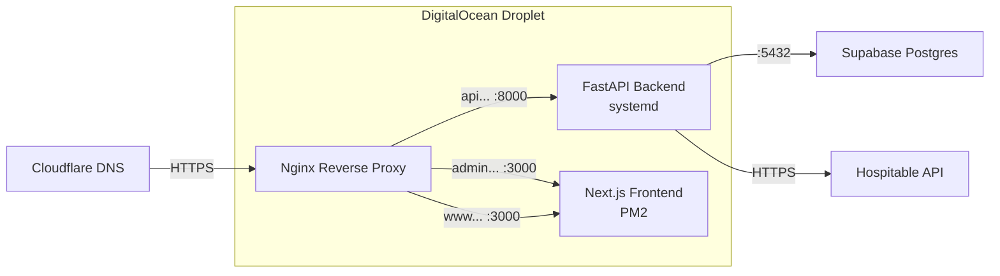

# Project Cleanup & Droplet Deployment Plan

## Part 1: Project Structure Cleanup

### Current Structure (Problems)

```
str_2/
├── .env                          ← Root-level env (duplicates backend/.env values)
├── .gitignore
├── hospitable-reference.md       ← Reference doc living at root
├── hospitable_api.json           ← 285KB API spec at root
├── screencapture-villasofdistinction.png  ← Stale screenshot artifact
├── start_dev.sh
├── backend/                      ← ✅ Good name
│   ├── .env
│   ├── seed.py
│   ├── requirements.txt
│   ├── venv/
│   └── app/
│       ├── api/
│       │   ├── routes/
│       │   │   ├── hospitable.py ← EMPTY file (dead code)
│       │   │   ├── admin/
│       │   │   └── public/
│       │   ├── router.py
│       │   └── dependencies.py
│       ├── core/
│       ├── db/
│       ├── models/
│       ├── schemas/
│       └── services/             ← Empty module (only __init__.py)
└── chicago-collective/           ← ❌ Should be "frontend"
    ├── next.config.ts            ← Duplicate config (also .mjs)
    ├── next.config.mjs           ← Duplicate config
    ├── postcss.config.js         ← Duplicate config (also .mjs)
    ├── postcss.config.mjs        ← Duplicate config
    ├── AGENTS.md                 ← AI agent instruction file
    ├── CLAUDE.md                 ← AI agent instruction file
    ├── fetch_reservations.js     ← Debugging script left behind
    ├── data/                     ← Empty directory
    └── src/
        ├── app/
        │   ├── api/admin/        ← Empty directory
        │   └── ...
        └── ...
```

### Proposed Structure

```
str_2/
├── .gitignore                    ✅ Keep (updated)
├── start_dev.sh                  ✅ Keep (updated paths)
├── docs/                         ✅ NEW — move reference docs here
│   ├── hospitable-reference.md
│   └── hospitable_api.json
├── backend/                      ✅ Keep
│   ├── .env
│   ├── requirements.txt
│   ├── seed.py
│   └── app/
│       ├── api/
│       │   ├── routes/
│       │   │   ├── admin/        (endpoints.py, hospitable.py, galleries.py)
│       │   │   └── public/       (endpoints.py, hospitable.py, properties.py)
│       │   ├── router.py
│       │   └── dependencies.py
│       ├── core/                 (config.py, security.py)
│       ├── db/                   (database.py)
│       ├── models/               (base.py, property.py)
│       └── schemas/              (auth.py)
└── frontend/                     ✅ RENAMED from chicago-collective
    ├── .env.local
    ├── next.config.ts            ✅ Keep (remove .mjs duplicate)
    ├── postcss.config.mjs        ✅ Keep (remove .js duplicate)
    ├── package.json
    ├── tailwind.config.js
    ├── tsconfig.json
    ├── public/                   (cleaned — remove unused Next.js starter SVGs)
    └── src/
        ├── app/
        │   ├── (public)/         Homepage, property pages
        │   ├── admin/            Admin dashboard, gallery, security
        │   ├── auth/             Auth callback
        │   └── layout.tsx
        ├── components/
        ├── lib/
        └── utils/
```

---

### Proposed Changes (Cleanup)

#### Root Level

##### [DELETE] [screencapture-villasofdistinction.png](file:///Users/neelpatel/str_2/screencapture-villasofdistinction.png)
Stale design reference screenshot. Not used anywhere.

##### [DELETE] [.env](file:///Users/neelpatel/str_2/.env)
Duplicates the backend `.env` and leaks secrets at root. The backend already has its own `.env`. This root copy only contains `HOSPITABLE_ACCESS_TOKEN` and `GOOGLE_MAPS_API_KEY`, both of which are already in their respective sub-project `.env` files.

##### [NEW] docs/
Move `hospitable-reference.md` and `hospitable_api.json` into a `docs/` directory to keep the root clean.

##### [MODIFY] [start_dev.sh](file:///Users/neelpatel/str_2/start_dev.sh)
Update `cd chicago-collective` → `cd frontend` after the rename.

##### [MODIFY] [.gitignore](file:///Users/neelpatel/str_2/.gitignore)
- Update all `chicago-collective/` references to `frontend/`.
- Add `backend/venv/` if not already covered.
- Add `__pycache__/` glob.

---

#### Backend

##### [DELETE] [routes/hospitable.py](file:///Users/neelpatel/str_2/backend/app/api/routes/hospitable.py)
Empty file — dead code. The real hospitable routes live inside `admin/` and `public/`.

##### [DELETE] backend/app/services/ (entire directory)
Empty module — only an `__init__.py` with no code. Can be re-added when services are actually needed.

##### [MODIFY] [config.py](file:///Users/neelpatel/str_2/backend/app/core/config.py)
- Add `CORS_ORIGINS` setting to make CORS configurable via `.env` instead of hardcoded in `main.py`.

##### [MODIFY] [main.py](file:///Users/neelpatel/str_2/backend/app/main.py)
- Use `settings.CORS_ORIGINS` instead of hardcoded localhost list.

---

#### Frontend (Rename + Cleanup)

##### Rename `chicago-collective/` → `frontend/`
The directory name "chicago-collective" is a branding name, not a role descriptor. Convention is `frontend/` in a monorepo alongside `backend/`.

##### [DELETE] [next.config.mjs](file:///Users/neelpatel/str_2/chicago-collective/next.config.mjs)
Duplicate of `next.config.ts`. Next.js only uses one config; having both causes confusion.

##### [DELETE] [postcss.config.js](file:///Users/neelpatel/str_2/chicago-collective/postcss.config.js)
Duplicate of `postcss.config.mjs`. The `.mjs` version is the correct one (uses `@tailwindcss/postcss`).

##### [DELETE] [fetch_reservations.js](file:///Users/neelpatel/str_2/chicago-collective/fetch_reservations.js)
One-off debugging script. No longer needed.

##### [DELETE] [AGENTS.md](file:///Users/neelpatel/str_2/chicago-collective/AGENTS.md) / [CLAUDE.md](file:///Users/neelpatel/str_2/chicago-collective/CLAUDE.md)
AI agent instruction files that shouldn't ship to production.

##### [DELETE] `data/` directory
Empty directory.

##### [DELETE] `src/app/api/admin/` directory
Empty directory — no route handlers inside.

##### [DELETE] Unused starter SVGs from `public/`
Remove `file.svg`, `globe.svg`, `next.svg`, `vercel.svg`, `window.svg` — these are Next.js create-app defaults never used by the project.

##### [MODIFY] [.env.local](file:///Users/neelpatel/str_2/chicago-collective/.env.local)
Remove the stale `ADMIN_PASSWORD` variable — auth is handled entirely through Supabase now.

##### [MODIFY] [package.json](file:///Users/neelpatel/str_2/chicago-collective/package.json)
Update `"name"` from `"chicago-collective"` to `"chicago-ave-collective-frontend"` for clarity.

---

## Part 2: Deployment to DigitalOcean Droplet

### Architecture Overview



### Nginx Configuration

| Domain | Route | Upstream |
|--------|-------|----------|
| `chicagoavecollective.com` | `/` | `localhost:3000` (Next.js) |
| `admin.chicagoavecollective.com` | `/` | `localhost:3000` (Next.js, middleware rewrites to `/admin`) |
| `api.chicagoavecollective.com` | `/` | `localhost:8000` (FastAPI) |

### Deployment Steps (Droplet setup changes required)

#### 1. Nginx Config
Create/Update `/etc/nginx/sites-available/chicagoavecollective.com`:
```nginx
server {
    listen 80;
    server_name chicagoavecollective.com www.chicagoavecollective.com admin.chicagoavecollective.com;

    # Frontend (Next.js)
    location / {
        proxy_pass http://127.0.0.1:3000;
        proxy_set_header Host $host;
        proxy_set_header X-Real-IP $remote_addr;
        proxy_set_header X-Forwarded-For $proxy_add_x_forwarded_for;
        proxy_set_header X-Forwarded-Proto $scheme;
        proxy_http_version 1.1;
        proxy_set_header Upgrade $http_upgrade;
        proxy_set_header Connection "upgrade";
    }
}

server {
    listen 80;
    server_name api.chicagoavecollective.com;

    # API proxy
    location / {
        proxy_pass http://127.0.0.1:8000;
        proxy_set_header Host $host;
        proxy_set_header X-Real-IP $remote_addr;
        proxy_set_header X-Forwarded-For $proxy_add_x_forwarded_for;
        proxy_set_header X-Forwarded-Proto $scheme;
    }
}
```

```bash
sudo ln -s /etc/nginx/sites-available/chicagoavecollective.com /etc/nginx/sites-enabled/
sudo nginx -t
sudo systemctl reload nginx
```

#### 2. Backend Config
The backend is exposed publicly at `https://api.chicagoavecollective.com` (routed via Nginx → `localhost:8000`).

Update `/var/www/str/backend/.env` with production env vars:
- `DATABASE_URL` — Supabase Postgres connection string
- `SUPABASE_URL`, `SUPABASE_KEY`, `SUPABASE_JWT_SECRET`, `SUPABASE_SERVICE_KEY`
- `HOSPITABLE_ACCESS_TOKEN`
- `CORS_ORIGINS` — `https://chicagoavecollective.com,https://admin.chicagoavecollective.com,http://localhost:3000`
- `BACKEND_URL` — `https://api.chicagoavecollective.com`

#### 3. Frontend Config
Update `/var/www/str/frontend/.env.local` with production values:
- `NEXT_PUBLIC_API_URL=https://api.chicagoavecollective.com`
- `NEXT_PUBLIC_GOOGLE_MAPS_API_KEY`
- `NEXT_PUBLIC_SUPABASE_URL`
- `NEXT_PUBLIC_SUPABASE_ANON_KEY`

#### 4. Cloudflare Config
- Ensure there are **A records** or **CNAMEs** for `@` (root), `www`, `admin`, and **`api`**, all pointing to the Droplet's IP address and verified to go through the Cloudflare proxy (orange cloud).

---

## Verification Plan

### After Cleanup
- `cd backend && source venv/bin/activate && uvicorn app.main:app --port 8000` — backend starts clean
- `cd frontend && npm run build` — Next.js builds without errors
- `cd frontend && npm run dev` — dev server runs correctly
